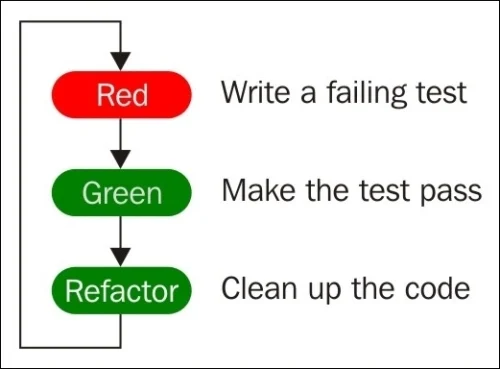

# 1. Getting Started with Test-Driven Development

Test-driven development is:

**Red:** Firstly write a test.

**Green:** Write a code to pass the test.

**Refactor:** Improve the code.

### Types of tests

**Developer tests:** Automated unit tests written by the developer.

**Unit testing:** Testing of a particular unit of an application.

**Integration testing:** Testing that involves two or more units working together.

