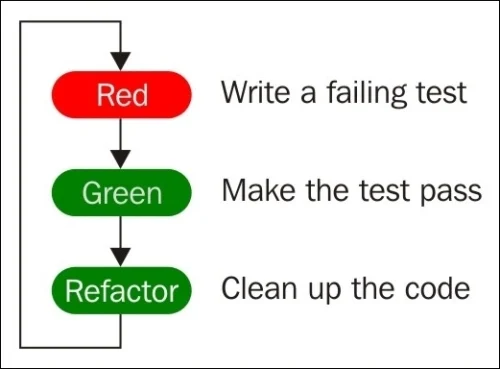

# 2. The TDD Cycle - Red-Green-Refactor

Test-driven development is:

**Red:** Firstly write a test.

**Green:** Write a code to pass the test.

**Refactor:** Improve the code.

### Steps of Refactor

**Arrange:** Set up the context for the test.

**Act:** Perform the action that we want to test.

**Assert:** Assert that the outcome was an expected.
